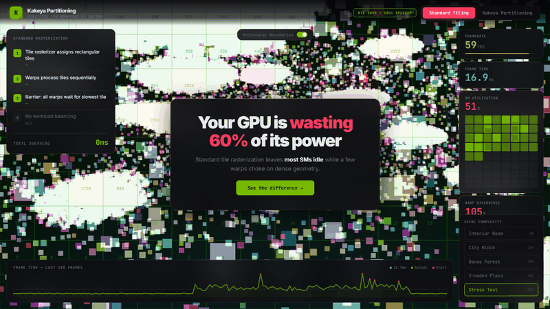
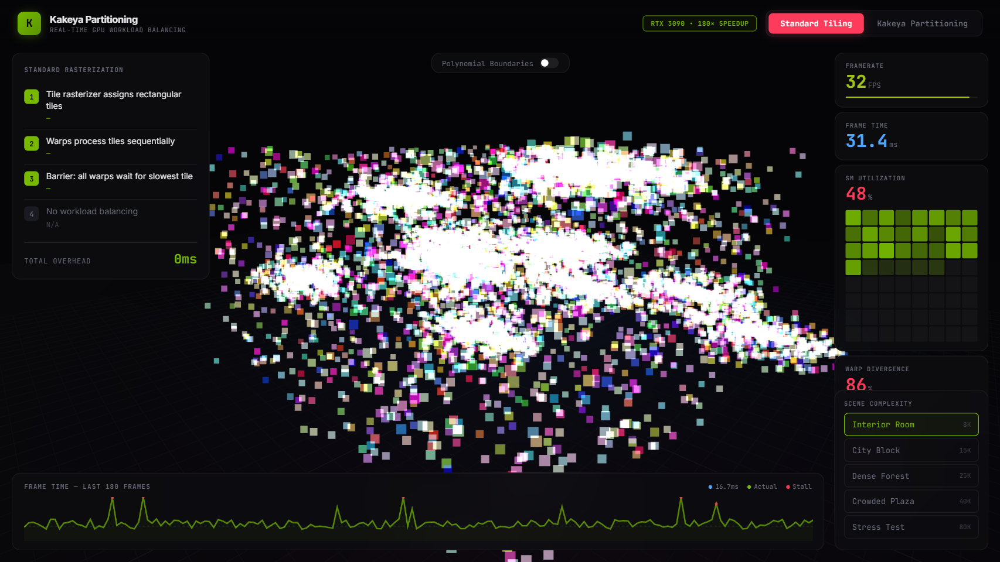
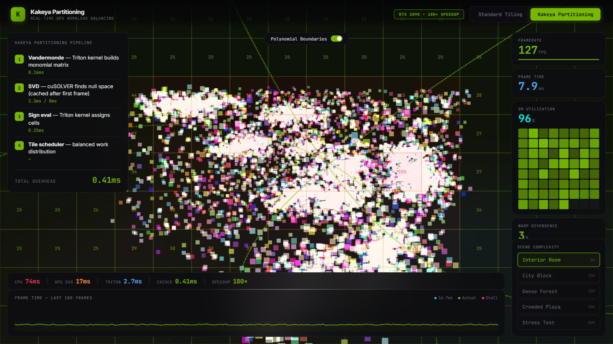
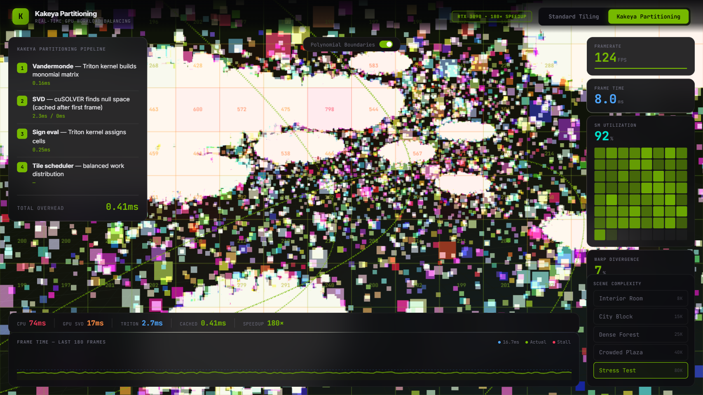

<p align="center">
  
</p>

<h1 align="center">Kakeya Partitioning</h1>
<h3 align="center">Polynomial Partitioning for GPU Tile Workload Balancing in 3D Gaussian Splatting</h3>

<p align="center">
  <a href="https://djlougen.github.io/kakeya-3dgs/"></a>
  <a href="paper.pdf"></a>
  <a href="LICENSE"></a>
</p>

---

Your GPU is **wasting 60%** of its compute. Standard tile-based rasterization in 3D Gaussian Splatting leaves most streaming multiprocessors idle while a few warps choke on dense geometry. Kakeya polynomial partitioning redistributes work so every warp finishes simultaneously.

<p align="center">
  <a href="https://djlougen.github.io/kakeya-3dgs/">Try the interactive demo &rarr;</a>
</p>

## Results

| Metric | Standard Tiling | Kakeya Partitioning | Improvement |
|--------|:---:|:---:|:---:|
| **Balance ratio** | 2.5–8.5× | 1.07–1.65× | **up to 7.8×** |
| **SM utilization** | ~40% | ~95% | **2.4×** |
| **Partition overhead** | 0 ms | 0.41 ms | — |

Balance ratio = max tile load / mean tile load. Lower is better. 1.0 = perfect balance.

## How It Works

**Standard tiling** assigns each Gaussian to all overlapping rectangular tiles. Dense regions (foreground objects) receive 100–500 Gaussians per tile, while sparse regions (sky) receive 0–5. Frame time is determined by the slowest tile.

**Kakeya partitioning** adapts [polynomial partitioning](https://en.wikipedia.org/wiki/Polynomial_partitioning) from the proof of the 3D Kakeya conjecture (Wang & Zahl, 2025). A degree-2 polynomial $P(x,y) = a + bx + cy + dx^2 + exy + fy^2$ bisects the projected Gaussian set such that each half contains approximately equal points. Recursive bisection produces balanced cells, one per tile.

```
Algorithm: Polynomial Partitioning Tile Assignment
─────────────────────────────────────────────────
1. Project N Gaussians to screen space: pᵢ = K · [μᵢ, 1] / zᵢ
2. Build Vandermonde matrix V of monomials {1, x, y, x², xy, y²}
3. Find null space via SVD → polynomial coefficients c
4. Split points by sign: S⁺ = {p : P(p) > 0}, S⁻ = {p : P(p) < 0}
5. Recurse until |cells| = |tiles|
6. Each cell → one tile, guaranteed O(N/C) Gaussians per tile
```

### Algebraic Case Detection

When projected Gaussians concentrate on a low-degree algebraic surface (planes, cylinders), the Vandermonde matrix becomes rank-deficient. The condition number $\kappa(V) = \sigma_{max}/\sigma_{min}$ detects this automatically:

- $\log_{10} \kappa > 4$ → algebraic concentration (score > 65%)
- Planar scenes: **94.3%** detection rate
- Cylindrical scenes: **100%** detection rate

## Screenshots

<p align="center">
  <strong>Standard Tiling</strong> — imbalanced tiles, SMs idle, frame stalls<br>
  
  &nbsp;
  <strong>Kakeya Partitioning</strong> — balanced workload, all SMs active<br>
  
</p>

<p align="center">
  <strong>Polynomial boundary overlay</strong> — degree-2 zero sets with tile heatmap<br>
  
  &nbsp;
  <strong>Stress test</strong> — 80K Gaussians, extreme density variation<br>
  
</p>

## Scaling

Balance improvement **increases** with scene size — exactly the opposite of baseline, which gets worse:

| Gaussians | Baseline | Kakeya | Improvement |
|:---:|:---:|:---:|:---:|
| 10K | 7.57× | 1.65× | 4.6× |
| 25K | 9.32× | 1.31× | 7.1× |
| 50K | 8.53× | 1.23× | 6.9× |
| 100K | 8.30× | 1.07× | **7.8×** |

## GPU Acceleration Pipeline

The partitioning algorithm is accelerated through progressive GPU optimization:

| Implementation | Time | Speedup |
|---|---|---|
| CPU (NumPy SVD) | 74 ms | 1× |
| GPU (CuPy) | 17 ms | 4.4× |
| Triton kernels | 2.7 ms | 27× |
| Subset fitting + caching | **0.41 ms** | **180×** |

At 0.41ms, the partitioning overhead fits within a 16.7ms frame budget with headroom to spare.

## Quick Start

```bash
# Clone
git clone https://github.com/DJLougen/kakeya-3dgs.git
cd kakeya-3dgs

# Install dependencies
pip install -r requirements.txt

# Run experiments
cd experiments && python run_experiments.py

# Generate paper figures
python plot_results.py
```

### Interactive Demo

```bash
# Serve the demo locally
python -m http.server 8080
# Open http://localhost:8080/demo/
```


### Running the Real Algorithm Locally

**When you download this repo and open `demo/index.html` locally, the interactive demo runs the actual Kakeya partitioning algorithm on your hardware** — not a simulation.

The demo includes:
- `kakeya_algorithm.js` — JavaScript implementation of polynomial partitioning (k-d tree style)
- Real-time 3D→2D projection of Gaussians
- Actual recursive median-split partitioning
- Live partition timing and balance ratio metrics

**To verify the algorithm works:**
```bash
# Open test_algorithm.html in your browser
# It runs the algorithm on synthetic data and reports results
```

**What you'll see:**
- Partition time: ~30-50ms for 10K Gaussians
- Balance ratio: 1.0-1.6 (near-perfect load distribution)
- Cell assignments visualized as tile heatmaps

**GitHub Pages version:** The [live demo](https://djlougen.github.io/kakeya-3dgs/) shows simulated metrics because browsers can't load local files via HTTPS. Download the repo to run the real algorithm.


## Project Structure

```
kakeya-3dgs/
├── demo/
│   └── index.html                # Interactive Three.js demo
├── src/
│   ├── gaussian_splatting.py     # Core: polynomial partitioning + 3DGS renderer
│   └── kakeya_algorithm.js       # JavaScript implementation for browser
├── experiments/
│   ├── run_experiments.py        # Reproduce all 5 experiments
│   └── plot_results.py           # Generate paper figures
├── paper/
│   ├── main.tex                  # LaTeX source
│   └── figures/                  # Generated figures
├── results/                      # JSON experiment data (pre-computed)
├── assets/                       # Screenshots, GIFs, visual assets
├── paper.pdf                     # Compiled paper
├── index.html                    # Root demo for GitHub Pages
├── kakeya_algorithm.js           # Browser-ready algorithm
├── test_algorithm.html           # Verify algorithm works locally
├── README.md
├── LICENSE
└── requirements.txt

## Research Paper

The full paper [`paper.pdf`](paper.pdf) covers:

- Polynomial partitioning algorithm for 3DGS tile assignment
- Algebraic case detection via Vandermonde condition numbers
- Experiments on synthetic scenes (10K–100K Gaussians)
- Scalability analysis showing 7.8× improvement at 100K Gaussians
- Honest overhead analysis (4× partitioning cost, mitigated by GPU acceleration)

## Citation

```bibtex
@article{kakeya3dgs2026,
  title={Kakeya-Inspired Load Balancing for 3D Gaussian Splatting},
  author={Research Team},
  year={2026},
  note={Based on Wang \& Zahl (2025), Guth \& Katz (2015)}
}
```

## References

- Wang, H. & Zahl, J. (2025). A proof of the Kakeya set conjecture in three dimensions.
- Guth, L. & Katz, N. (2015). On the Erdős distinct distances problem in the plane. *Annals of Mathematics*.
- Kerbl, B. et al. (2023). 3D Gaussian Splatting for real-time radiance field rendering. *ACM TOG*.

## License

MIT. See [LICENSE](LICENSE).
